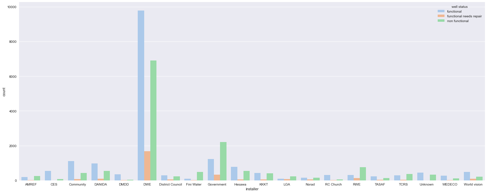

# Project 3 Tanzanian Water Wells

## Overview
This is a categorical regression of water wells in Tazmania for a non-profit organization to determine which wells need maintenance or are defunct and require new wells entirely. The goal of this project is to predict with as much accuracy as possible which water wells in the Republic of Tasmania require maintenence or new waterwells built. The main goal of this project is to provide suggestions to a nonprofit on how to allocate funds, provide maintanence on pumps based on features provided in the data set, and determine if new wells need to be built as a result of defunct water wells to continue to provide vital, potable clean water to the local populace.

## Business and Data Understanding
Data was congregated by Driven Data from Taarifa and the Republic of Tmania's Ministry of Water for the purpose of predicting which water wells are faulty. Predictions will be made based of data regarding the type of pumps, time since it was installed and how it has been managed since. The main goal of this project is to provide suggestions to a nonprofit to fund maintanence on pumps that could fail to save the cost of building new wells as a result of defunct water wells to continue to provide vital, potable clean water to the local populace.

## Modeling
Started with the following basic visualizations during data cleaning to deepen domain knowledge of the dataset. All of them were grouped by status_group. 

Source Type

Extraction Type

Region

Construction Decade 

Installer

## Evaluation
In constructing different models to predict if a well will be functional or not we started with a basic log regression to get a nice baseline. A ROC AUC and accuracy score was used to compare models to see how accurate our model is at predicting correctly our classifications. The inital model had a score of: 
ROC AUC Score: 0.7545
Accuracy Score:  0.7921885521885522 

We then used a Decision Tree Classifier which improved our evaluation metrics. 
ROC AUC Score: 0.7911
Accuracy:  0.8188552188552188

I then chose modeling with a Random Tree Classifier as it is more resistent to overfitting and it again improved scores but only marginally. The downside though is it is more computationally intensive.
ROC AUC Score: 0.7911
Accuracy:  0.8188552188552188

Next I explored changing hyperparameters before running our model to see if we could improve performance. I looked at and graphed the following hyperparameters:
Tree Depth

Minimum sample leafs

Minimum sample splits

## Conclusion
Overall Business Strategy: The non-profit organization should optimize resource allocation by focusing on high-risk wells such as: certain installers, older wells, and less reliable water sources particularly in areas with more nonfunctional wells than functional. Combining data-driven decision-making with targeted maintenance strategies will reduce costs associated with building new wells and increase the operational lifespan of existing water wells, ultimately benefiting the local population with a sustainable water supply.

Put more succintly
* Wells installed by District Water Engineers (DWE) are more likely to be functioning over those installed by the Government or by Fini Water, use DWE for new well development focused in Tabora, Dodoma, Mara, Rukwa, and Lindi regions first
* Focus repair efforts on wells older than 2000 as they are more likely to be in disrepair
* Where new wells need to be created focus on natural resources such as springs, rivers and lakes. Sources such as boreholes or dams are much more likely to be nonfunctional.

### Navigating the Repository
data
    * test-set-values.csv
    * training-set-values.csv
    * training-set-labels.csv
images 
    * ROC_curve_model_evaluation.png
    * construction_decade.png
    * extraction_type.png
    * hyperparameter_max_depth.png
    * hyperparameter_min_sample_leafs.png
    * hyperparameter_min_sample_split.png
    * installer.png
    * region_well_source.png
    * water_well_source_bar.png
.gitignore
README.md
project-3-tazmanian-water-wells.ipynb
project-3-presentation
### Link to Presentation